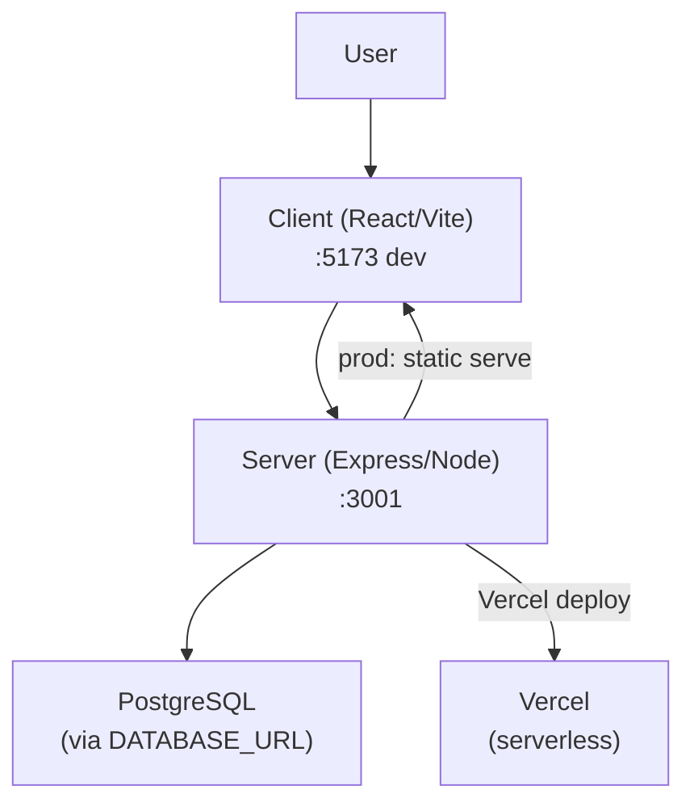

# FinanceTracker (Balqen) — Project Memory Graph

> **Last updated:** 2026-10-02 | **Workspace:** `d:\Personal Projects\FinanceTracker`

---

## 🗂️ Project Identity

| Field | Value |
|---|---|
| **App name** | Balqen |
| **Tagline** | "Track your money, people, and loans" |
| **npm package** | `balqen` (monorepo root) |
| **Repo root** | `d:\Personal Projects\FinanceTracker\` |
| **Main workspace** | `FinanceTracker/` (npm workspaces: `server`, `client`) |

---

## 🏗️ Architecture Overview



- **Dev mode**: Two separate servers — Vite dev server + Express API
- **Production**: Single Express server serves both the REST API and the compiled React SPA
- **Vercel**: Serverless deployment via `api/` folder + static frontend output in `public/`

---

## 📁 Directory Structure

```
FinanceTracker/                      ← repo root
├── Makefile                         ← top-level dev commands
├── README.md
├── DEPLOYMENT.md
├── personal-finance-tracker-requirements.md
├── DatabaseDesign/
│   └── database.sql                 ← full DB schema reference
└── FinanceTracker/                  ← npm workspace root
    ├── package.json                 ← "balqen" monorepo (workspaces: server, client)
    ├── vercel.json                  ← Vercel routing config
    ├── vercel-build.js              ← custom Vercel build script
    ├── api/
    │   ├── index.js                 ← Vercel serverless entry
    │   └── _server.js               ← bundled server for Vercel (~2.3 MB)
    ├── client/                      ← "balqen-client" package
    │   ├── package.json
    │   ├── vite.config.ts
    │   ├── tailwind.config.js
    │   ├── tsconfig.json
    │   ├── index.html
    │   └── src/
    │       ├── main.tsx             ← React entry (BrowserRouter, QueryClient, AuthProvider)
    │       ├── App.tsx              ← Route definitions (lazy-loaded)
    │       ├── index.css            ← Global styles (Tailwind base)
    │       ├── api/
    │       │   └── client.ts        ← Axios instance + interceptors
    │       ├── contexts/
    │       │   ├── AuthContext.tsx  ← Authentication state (user, login, logout)
    │       │   └── ThemeContext.tsx ← Light/dark theme toggle
    │       ├── components/          ← Shared UI components
    │       ├── pages/               ← Route-level page components
    │       ├── types/
    │       │   └── index.ts         ← Shared TypeScript types
    │       └── utils/
    │           ├── format.ts        ← Currency/date formatters
    │           └── smartSuggestions.ts ← AI-like autocomplete logic
    └── server/                      ← "balqen-server" package
        ├── package.json
        ├── tsconfig.json
        ├── vitest.config.ts
        ├── .env                     ← Local env vars (DATABASE_URL, JWT_SECRET, etc.)
        ├── .env.example
        ├── .env.production.example
        └── src/
            ├── app.ts               ← Express app entry point
            ├── database/
            │   ├── connection.ts    ← pg.Pool (max 20 conn, via DATABASE_URL)
            │   ├── setup.ts         ← DB create + schema apply
            │   ├── migrate.sql      ← Migration SQL
            │   ├── reset.ts         ← Drop + recreate schema
            │   ├── seed.ts          ← Seed default categories
            │   └── check.ts         ← DB connectivity check
            ├── middleware/
            │   ├── auth.ts          ← JWT verification middleware
            │   ├── rateLimit.ts     ← express-rate-limit (apiLimiter)
            │   └── validation.ts    ← Zod-based request validation
            ├── routes/              ← Express routers
            ├── services/            ← Business logic services
            ├── shared/              ← Shared server utilities
            │   ├── financial.ts     ← Financial calculation helpers
            │   ├── id.ts            ← ID generation
            │   └── token.ts         ← JWT token utilities
            ├── types/
            │   └── index.ts         ← Server-side TypeScript types
            └── __tests__/           ← Vitest test suite
```

---

## 🖥️ Client — Pages & Routes

| Route | Page Component | Description |
|---|---|---|
| `/login` | `LoginPage.tsx` | User login (public) |
| `/register` | `RegisterPage.tsx` | User registration (public) |
| `/forgot-password` | `ForgotPasswordPage.tsx` | Password reset request (public) |
| `/reset-password` | `ResetPasswordPage.tsx` | Password reset with token (public) |
| `/` | `DashboardPage.tsx` | Financial overview & charts |
| `/transactions` | `TransactionsPage.tsx` | Transaction list, filter, CRUD |
| `/accounts` | `AccountsPage.tsx` | Bank/wallet accounts management |
| `/people` | `PeoplePage.tsx` | Contacts/people management |
| `/loans` | `LoansPage.tsx` | Loan tracking (give/receive) |
| `/categories` | `CategoriesPage.tsx` | Income/expense categories |
| `/reports` | `ReportsPage.tsx` | Analytics & reports (118 KB!) |
| `/settings` | `SettingsPage.tsx` | User profile & preferences |
| `*` | `NotFoundPage.tsx` | 404 fallback |

All protected routes are wrapped in `ProtectedRoute` → redirect to `/login` if not authenticated.  
All public routes are wrapped in `PublicRoute` → redirect to `/` if already authenticated.

---

## 🧩 Client — Components

| Component | Purpose |
|---|---|
| `Layout.tsx` | Main app shell (sidebar, nav, outlet) |
| `Modal.tsx` | Generic modal wrapper |
| `ConfirmModal.tsx` | Destructive action confirmation |
| `QuickTransactionModal.tsx` | Fast transaction entry |
| `VoucherModal.tsx` | Voucher/receipt viewer |
| `PrintPreviewModal.tsx` | Print-ready transaction view |
| `GlobalSearchModal.tsx` | Cross-entity search |
| `CreatePresetModal.tsx` | Save transaction presets |
| `KeyboardShortcutsModal.tsx` | Keyboard shortcut reference |
| `ThemeToggle.tsx` | Light/dark mode switch |
| `Pagination.tsx` | Table pagination controls |
| `EmptyState.tsx` | Empty list placeholder |
| `ErrorBoundary.tsx` | React error boundary |
| `QueryError.tsx` | React Query error display |
| `LoadingSpinner.tsx` | Loading indicator |
| `loans/LoanCreateModal.tsx` | Create new loan |
| `loans/LoanDetailsModal.tsx` | View loan details |
| `loans/LoanRepayModal.tsx` | Record loan repayment |
| `loans/LoanAddFundsModal.tsx` | Add funds to loan |

---

## 🔌 Server — API Routes

| Route | File | Description |
|---|---|---|
| `POST /api/auth/*` | `routes/auth.ts` | Login, register, refresh, logout, password reset |
| `GET/POST /api/accounts` | `routes/accounts.ts` | Account CRUD |
| `GET/POST /api/people` | `routes/people.ts` | People/contacts CRUD |
| `GET/POST /api/categories` | `routes/categories.ts` | Category CRUD |
| `GET/POST /api/transactions` | `routes/transactions.ts` | Transaction CRUD + filtering |
| `GET/POST /api/loans` | `routes/loans.ts` | Loan CRUD + repayments |
| `GET /api/dashboard` | `routes/dashboard.ts` | Dashboard summary data |
| `GET /api/reports` | `routes/reports.ts` | Reports & analytics queries |
| `GET /api/health` | `app.ts` | Health check |

All routes except `/api/auth` are protected by `apiLimiter` (rate limiting).  
All routes respond with `{ success: boolean, data?: ..., error?: { code, message } }`.

---

## 🛠️ Server — Services

| Service | Purpose |
|---|---|
| `services/email.ts` | Nodemailer email sending (password reset, notifications) |
| `services/lockout.ts` | Account lockout logic (failed login tracking) |
| `services/voucher.ts` | Voucher generation |

---

## 🗄️ Database

- **Engine**: PostgreSQL
- **Client**: `pg` (node-postgres) with connection pool (max 20)
- **Connection**: `DATABASE_URL` environment variable
- **Schema**: `DatabaseDesign/database.sql` (full reference) + `server/src/database/migrate.sql` (migrations)
- **Key entities**: Users, Accounts, People, Categories, Transactions, Loans, LoanTransactions

---

## 📦 Tech Stack

### Client
| Layer | Tech |
|---|---|
| Framework | React 18 + TypeScript |
| Build tool | Vite 5 |
| Routing | React Router DOM v6 |
| Data fetching | TanStack React Query v5 |
| HTTP client | Axios |
| Styling | Tailwind CSS v3 |
| Icons | Lucide React |
| Charts | Recharts |
| Toasts | React Hot Toast |

### Server
| Layer | Tech |
|---|---|
| Runtime | Node.js |
| Framework | Express 4 |
| Language | TypeScript (tsx for dev, tsc for build) |
| Database | PostgreSQL via `pg` |
| Auth | JWT (jsonwebtoken) + bcrypt |
| Validation | Zod |
| Email | Nodemailer |
| Security | Helmet, CORS, express-rate-limit |
| Testing | Vitest |

---

## ⚙️ Environment Variables (Server)

Key variables from `.env.example`:
- `DATABASE_URL` — PostgreSQL connection string
- `JWT_SECRET` — JWT signing secret
- `JWT_REFRESH_SECRET` — Refresh token secret
- `CORS_ORIGIN` / `FRONTEND_URL` — Allowed frontend origins
- `PORT` — Server port (default: 3001)
- `NODE_ENV` — `development` | `production`
- `SMTP_*` — Nodemailer email config

---

## 🚀 Dev Workflow (Makefile)

| Command | What it does |
|---|---|
| `make install` | Install all deps (client + server + root) |
| `make dev` | Run both servers concurrently |
| `make dev-server` | Backend only |
| `make dev-client` | Frontend only |
| `make build` | Build both for production |
| `make start` | Production server (single-server mode) |
| `make db-create` | Create DB + apply schema |
| `make db-reset` | Drop + recreate schema |
| `make db-seed` | Seed default categories |
| `make test` | Run Vitest tests |
| `make typecheck` | TypeScript checks on both |
| `make status` | Show deps/build/db/port status |
| `make setup` | install + db-create |
| `make deploy-setup` | install + build (Vercel prep) |

---

## 🌐 Deployment

- **Vercel**: `vercel.json` routes `/api/*` → `api/index.js` (serverless), static assets from `public/`
- **Single-server**: Build both, run `make start` — Express serves the React SPA + API from one process
- **Build output**: `client/dist/` (Vite) + `server/dist/` (tsc)
